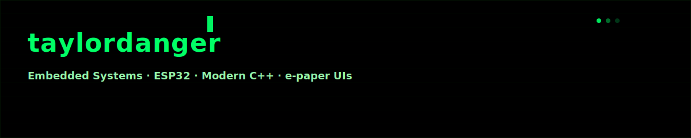
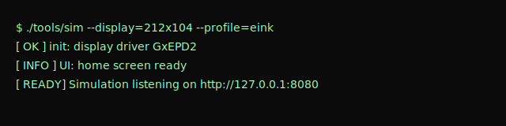

<<<<<<< HEAD
# Taylor Danger — Embedded Systems Engineer

[](https://github.com/taylordanger)  
[](https://linkedin.com/in/taylordanger)

# Taylor Danger — Embedded Systems Engineer

[](https://github.com/taylordanger)  
[](https://linkedin.com/in/taylordanger)



I design firmware and small-screen device UIs that feel polished and reliable. I focus on testable architecture, reproducible tooling, and UX that respects constrained hardware.

• Embedded systems (ESP32) • Modern C++ • e‑paper displays • Testable UI tooling

---

## Quick facts

- **Role:** Embedded Systems Engineer
- **Location:** Remote / Hybrid
- **Availability:** Open to collaboration & freelance

---

## Skills & tools

- **Languages:** C, C++ (modern), Python, TypeScript
- **Embedded:** ESP32, FreeRTOS, Arduino framework
- **Displays & UI:** GxEPD, Adafruit GFX, e‑paper UX patterns
- **Tooling:** CMake, Git, CI, automated asset generation

Proficiency: C/C++ · Embedded systems · Python/tooling · Rust (learning)

---

## Selected projects

- **ESP32-Virtualpet** — Virtual pet on ESP32: persistent state, efficient render loops, playful UX patterns.  
  [ESP32-Virtualpet](https://github.com/taylordanger/ESP32-Virtualpet)

- **GxEPD-Multiple-Epaper-Screen-Example** — Multi-screen patterns and transitions for e‑paper devices.  
  [GxEPD-Multiple-Epaper-Screen-Example](https://github.com/taylordanger/GxEPD-Multiple-Epaper-Screen-Example)

- **Open-source contributions** — Small, high-impact PRs to improve e‑paper and embedded tooling reliability.

---

## How I work

- Build small, testable abstractions so UI logic can run on desktop and on-device.
- Prefer incremental changes, reproducible builds, and automated asset generation.
- Treat UX for constrained devices as a first-class engineering problem.

---

## Live demo (visual)

# Taylor Danger — Embedded Systems Engineer

[](https://github.com/taylordanger)  
[](https://linkedin.com/in/taylordanger)


I design firmware and small-screen device UIs that feel polished and reliable. I focus on testable architecture, reproducible tooling, and UX that respects constrained hardware.

• Embedded systems (ESP32) • Modern C++ • e‑paper displays • Testable UI tooling

---

## Quick facts

- **Role:** Embedded Systems Engineer
- **Location:** Remote / Hybrid
- **Availability:** Open to collaboration & freelance

---

## Skills & tools

- **Languages:** C, C++ (modern), Python, TypeScript
- **Embedded:** ESP32, FreeRTOS, Arduino framework
- **Displays & UI:** GxEPD, Adafruit GFX, e‑paper UX patterns
- **Tooling:** CMake, Git, CI, automated asset generation

Proficiency: C/C++ · Embedded systems · Python/tooling · Rust (learning)

---

## Selected projects

- **ESP32-Virtualpet** — Virtual pet on ESP32: persistent state, efficient render loops, playful UX patterns.  
  https://github.com/taylordanger/ESP32-Virtualpet

- **GxEPD-Multiple-Epaper-Screen-Example** — Multi-screen patterns and transitions for e‑paper devices.  
  https://github.com/taylordanger/GxEPD-Multiple-Epaper-Screen-Example

- **Open-source contributions** — Small, high-impact PRs to improve e‑paper and embedded tooling reliability.

---

## How I work

- Build small, testable abstractions so UI logic can run on desktop and on-device.
- Prefer incremental changes, reproducible builds, and automated asset generation.
- Treat UX for constrained devices as a first-class engineering problem.

---

## 🎬 Live demo



**Try the simulator:**  
[](https://asciinema.org/a/XXXX) [](images/demo.gif)

*Replace XXXX with your asciinema recording ID, or add `images/demo.gif` to show an animated preview.*

How to create and embed a demo

1. Record an interactive session with asciinema (recommended):

```bash
# record the session interactively
asciinema rec demo.cast --command="./tools/sim --display=212x104 --profile=eink"
```

1. Upload to asciinema (optional) or convert to GIF for embedding:

```bash
# upload (gives you a public URL you can link)
asciinema upload demo.cast

# convert to GIF locally (third-party tools exist, e.g. asciinema2gif)
asciinema2gif demo.cast images/demo.gif
```

1. Commit `images/demo.gif` (or `images/demo.svg`) to your repo — images render inline on GitHub READMEs.

Fallback: static example (keeps the command visible for people who want to run the simulator locally)

```bash
$ ./tools/sim --display=212x104 --profile=eink
[  OK  ] init: display driver GxEPD2
[  OK  ] load: assets (18 items)
[ INFO ] UI: home screen ready
[ INFO ] input: map keys -> {A:left, B:select, C:right}
[ READY] Simulation listening on http://127.0.0.1:8080
> press [A] [B] [C] to simulate button events
```

---

## Try / clone

```bash
git clone https://github.com/taylordanger/ESP32-Virtualpet
git clone https://github.com/taylordanger/GxEPD-Multiple-Epaper-Screen-Example
```

---

## Contact

- [LinkedIn](https://linkedin.com/in/taylordanger)
- [GitHub](https://github.com/taylordanger)
- [Email](mailto:lauren.taylor.sheppard@gmail.com)

---

If you'd like, I can:

- Add build/coverage badges and a resume link
- Create a short contributor guide or a pinned projects section
- Tweak tone/length for hiring vs. open-source audiences

Tell me which style you prefer (compact, friendly, or technical) and I will iterate.
| Role | Location | Availability |
|---|---|---:|
| Embedded Systems Engineer | Remote / Hybrid | Open to collaboration & freelance |

---

## Tech & proficiency
| Core | Tools & Frameworks |
|---|---|
| C / C++ / Embedded | ESP32 · FreeRTOS · Arduino framework |
| UI / Displays | GxEPD · Adafruit GFX · e‑paper UX |
| Scripting & Tools | Python · TypeScript · CMake · Git · CI |

Proficiency snapshot (visual):
- C/C++ ▉▉▉▉▉▉▉▉▉▉  
- Embedded systems ▉▉▉▉▉▉▉▉▉◻  
- Python / Tooling ▉▉▉▉▉▉▉▉◻◻  
- Rust (learning) ▉▉▉◻◻◻◻◻◻◻

---

## Projects (high signal)
| Project | Highlights |
|---|---|
| [ESP32-Virtualpet](https://github.com/taylordanger/ESP32-Virtualpet) | Virtual pet on ESP32 — persistent state, efficient render loops, playful UX patterns. |
| [GxEPD-Multiple-Epaper-Screen-Example](https://github.com/taylordanger/GxEPD-Multiple-Epaper-Screen-Example) | Multi-screen patterns and transitions for e‑paper devices. |
| Open source contributions | Focused PRs and fixes to improve e‑paper and embedded tooling reliability. |

---

## How I work
- Design small, testable abstractions so UI logic can run on desktop and on-device.
- Prefer incremental changes, reproducible builds, and automated asset generation.
- Treat UX for constrained devices as a first-class engineering problem.

---

## Dev terminal — device simulator (flavor)
```bash
$ ./tools/sim --display=212x104 --profile=eink
[  OK  ] init: display driver GxEPD2
[  OK  ] load: assets (18 items)
[ INFO ] UI: home screen ready
[ INFO ] input: map keys -> {A:left, B:select, C:right}
[ READY] Simulation listening on http://127.0.0.1:8080
> press [A] [B] [C] to simulate button events
```

---

## Try / clone
```bash
git clone https://github.com/taylordanger/ESP32-Virtualpet
git clone https://github.com/taylordanger/GxEPD-Multiple-Epaper-Screen-Example
```

---

## Contact
- LinkedIn: https://linkedin.com/in/taylordanger  
- GitHub: https://github.com/taylordanger  
- Email: lauren.taylor.sheppard@gmail.com

=======
>>>>>>> 311ac27748a902bfe4e519e97469b6c4cb8ae2ab

