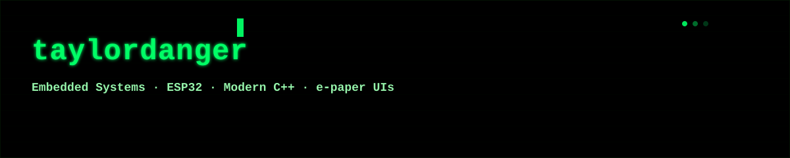

```
# Taylor  — Embedded Systems Engineer

<div align="center">



</div>

```bash
$ whoami
 taylordanger@workstation:~$ Embedded systems engineer focused on ESP32, FreeRTOS,
                           and high-quality UI/UX on constrained displays.
```

```bash
$ cat ~/profile
 Name:     Taylor
 Role:     Embedded Systems Engineer / Firmware Developer
 Focus:    ESP32 • FreeRTOS • e‑paper UI • Modern C++
 Location: Remote / Hybrid
 Status:   Open for hire
```

```bash
$ grep -r "capabilities" ~/skills/core.h
 ESP32           : enabled
 Modern C++      : enabled
 E‑paper         : enabled
 Real‑time (RT)  : enabled
 UI Architecture : enabled
```

---

**System Overview**

```bash
$ ./run_diagnostics.sh --stack
╔═══════════════════════[ TECH STACK ]════════════════════════╗
║                                                             ║
║  PROGRAMMING                                                ║
║  • C/C++            █████████████████   Expert              ║
║  • Python           ███████████████░░   Advanced            ║
║  • TypeScript       █████████████░░░░   Proficient          ║
║  • Rust             ███████░░░░░░░░░    Learning            ║
║                                                             ║
║  EMBEDDED & HARDWARE                                        ║
║  • ESP32 / ESP‑IDF   █████████████████   Expert             ║
║  • FreeRTOS         ███████████████░░    Advanced           ║
║  • Arduino          █████████████████    Expert             ║
║  • E‑paper Displays ███████████████░░    Specialist         ║
║                                                             ║
║  TOOLING                                                   ║
║  • Git/GitHub       █████████████████    Advanced           ║
║  • CMake            █████████████░░░░    Proficient         ║
║  • CI/CD            ███████████░░░░░     Intermediate       ║
║                                                             ║
╚═════════════════════════════════════════════════════════════╝
```

<div align="center">


</div>

---

**Featured Projects**

```bash
$ ls ~/projects/featured
 esp32-virtualpet
 multi-epaper-manager
 open-source-contrib
```

```bash
$ ./project_info.sh --detailed
╔══════════════════════[ PROJECTS ]═══════════════════════════╗
║                                                             ║
║ ESP32‑VirtualPet                                            ║
║  • Tamagotchi‑style companion running on ESP32              ║
║  • Real‑time simulation with persistent state               ║
║  • Efficient rendering pipeline on constrained hardware     ║
║  • Low‑power management (deep sleep)                        ║
║  → repo: github.com/taylordanger/ESP32-Virtualpet          ║
║                                                             ║
║ Multi‑Epaper‑Manager                                        ║
║  • Orchestrates content across multiple e‑paper displays    ║
║  • Memory‑efficient graphics (small buffers)                ║
║  • Scheduling, rotation, and hardware abstraction           ║
║  → repo: github.com/taylordanger/GxEPD-Multiple-...        ║
║                                                             ║
║ Open Source Contributions                                   ║
║  • Bug fixes, performance work, documentation               ║
║  • Community support and code reviews                       ║
║                                                             ║
╚═════════════════════════════════════════════════════════════╝
```

[View ESP32‑VirtualPet](https://github.com/taylordanger/ESP32-Virtualpet) ·
[View Multi‑Epaper Manager](https://github.com/taylordanger/GxEPD-Multiple-Epaper-Screen-Example)

---

**Development Philosophy**

```bash
$ cat ~/.philosophy/embedded_manifesto.txt
 "The best embedded UI is one that users forget
  is running on a microcontroller."

 Principles
  • Desktop‑quality UX on microcontrollers
  • Zero‑compromise testing and CI
  • Hardware‑aware design: constraints inform solutions
  • Incremental, reproducible changes; no hidden magic
```

```bash
$ echo $WORKFLOW
 Small commits, big impact. Test everything, assume nothing.
```

---

**Skills & Tools**


---

**Contact**

- [LinkedIn](https://linkedin.com/in/taylordanger)
- [GitHub](https://github.com/taylordanger)
- [Email](mailto:lauren.taylor.sheppard@gmail.com)

